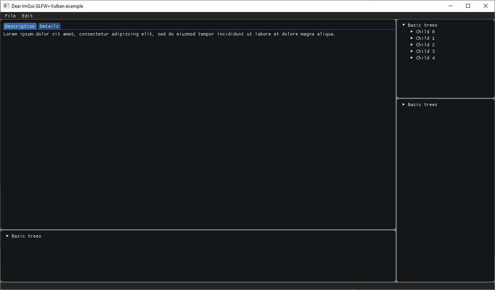

# Custom Dear ImGui Layout and extensions

This repository aims to provide a header only (The `CustomDearImGuiLayout.h`) Dear ImGui extension basing on Dear ImGui's main branch. The biggest benefits of this project to curious readers is to provide a flexible and relatively conventient Dear ImGui windows layout system reference.

Even though the docking branch of Dear ImGui is OK for layout, that is still hard to be harnessed to mimic a mature animation or game engine editor like Blender or UE. E.g. It is hard to give users a pre-defined editor layout and store the modified layout in their own projects; Drag out new windows from a corner or merge two windows. No to mention that the docking branch API is still unstable and maybe rewritten.



## Features and demos

The layout system can help you manage your mouse dragging of splitters and viewport resizing with layout ratio kept. Other windows related features are totally controlled by programmers in their code by using native DearImGui API. Here is an example:


## Building and configuration

The example under the `examples` folder relies on GLFW, DearImGUI and Vulkan. But, the header, which is the core of this project, doesn't necessarily rely on any DearImGUI backend like GLFW or Vulkan. So, you can choose any backend as you like or submit a PR to provide an example in the backend of your interest.

In order to build the `01_SimpleTwoLayouts`, please make sure you set the `VULKAN_SDK` environment variable to your VulkanSDK path. In addition, you also need to build the GLFW by yourself (Please build the glfw under the `import/glfw/build/src/Debug/` or you'll need to modify the CMake script). After fulfilling prerequisites, you can bulid your project by executing the following command in an example's folder.

`cmake -B build -G "Visual Studio 16 2019"`

## Code Example

```
...
void BasicTestLeftWindow()
{
    ImGui::Begin("Left Window", nullptr, nullptr);
    ImGui::End();
}

void BasicTestRightWindow()
{
    ImGui::Begin("Right Window", nullptr, nullptr);
    ImGui::End();
}

// Construct the starting layout. Return the root node.
DearImGuiExt::CustomLayoutNode* TestingLayout()
{
    // Central domain and its splitter. The input float is the normalized distance between the
    // root's splitter and the root's start position.
    DearImGuiExt::CustomLayoutNode* pRoot = new DearImGuiExt::CustomLayoutNode(0.8f);

    pRoot->SetLeftChild(new DearImGuiExt::CustomLayoutNode(BasicTestLeftWindow));
    pRoot->SetRightChild(new DearImGuiExt::CustomLayoutNode(BasicTestRightWindow));

    return pRoot;
}

void main()
{
    ...
    DearImGuiExt::CustomLayout myLayout(TestingLayout());
    while(1)
    {
        ...
        myLayout.BeginEndLayout();
        ImGui::Render();
        ...
    }
    ...
}

```

## Design Introduction

The layout uses a tree data structure to manage windows. Each windows is a leaf node and all others are called logical domain. A logical domain is a domain that can contain windows or other smaller logical domains. Besides, a logical domain has to have at least one splitter to divide itself and put its children into its divided areas. One child can only occupy one divided area and children that don't have any children are windows. 